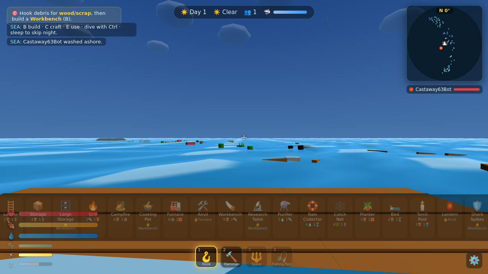

# 🌊 FLOTSAM — co-op ocean survival

You and your friends are castaways adrift on an endless sea. Hook the wreckage
that floats past, **build a raft**, craft tools, fish, fend off a **circling shark**,
and work toward the only way home: **build a Rescue Beacon, power it, and survive
the final hunt.**

It's a real-time 3D multiplayer game that runs in any modern browser — so it
works identically on **Mac and PC** with zero install for your friends. One person
runs the server; everyone else just opens a link.



---

## ▶ Quick start

You need [Node.js](https://nodejs.org) (LTS) installed — that's the only requirement.

- **macOS / Linux:** double-click `start.command` (or run `./start.sh`)
- **Windows:** double-click `start.bat`

It installs dependencies the first time, launches the server, and opens the game
in your browser at `http://localhost:8080`.

Prefer the command line?
```bash
npm install
npm start
# open http://localhost:8080
```

## 🎮 Playing with friends (the server)

The launcher prints your **LAN address** (e.g. `http://192.168.1.42:8080`).
Anyone on the **same Wi-Fi** can paste that into their browser and join instantly.

Playing over the internet? Tunnel the port — for example:
```bash
npx localtunnel --port 8080      # or: cloudflared tunnel --url http://localhost:8080
```
…and share the public URL. (WebSockets ride the same URL, so `https`/`wss` tunnels
just work.)

---

## 🕹️ Controls

| Key | Action |
|----|----|
| **WASD** | Move |
| **Shift** | Sprint (drains stamina) |
| **Mouse** | Look (click the game to capture the cursor) |
| **Space** | Jump / swim up |
| **Ctrl** | Dive down (watch your oxygen!) |
| **Left click** | Use held tool (hook · spear · bow · axe-harvest · cast rod · place build) |
| **Right click** | (in build mode) remove a tile/prop |
| **E** | Interact — Storage, cook, smelt, sleep, sail, **activate Beacon**, **revive** a downed crewmate |
| **1–9** | Select tool (hotbar grows as you craft tools) |
| **B** | Build menu (mouse-wheel or 1–9 to pick, click to place) |
| **C** / **Tab** | Craft & inventory |
| **F** / **G** | Quick eat / drink |
| **R** | Repair the structure you're looking at (costs wood) |
| **V** | Emote · **Middle click** ping a waypoint |
| **⚙ (bottom-right)** | Settings (sensitivity, volume, FOV, render distance, FPS, fullscreen) |
| **T** / **Enter** | Chat |

## 🎯 How to win

1. **Hook debris** drifting past for Wood, Plastic, Fiber, Scrap.
2. **Expand the raft** (Foundations) and add **Walls** to keep the shark off the deck.
3. **Survive:** eat (fish you catch + cook on a **Grill**, rations, coconuts) and
   drink (Fresh Water from a **Purifier** or barrels). Watch your ❤️🍖💧 bars.
4. **Tech up:** smelt Scrap → **Metal**, make **Circuits**, then a **Battery** and a
   **Beacon Core**.
5. **Build the Rescue Beacon**, press **E** to **activate it**, then **survive a 90-second
   shark onslaught** — and you're rescued. 🚁

The shark gets bolder at **night** and in **storms**. Fight it off with a **Spear**, **Metal
Spear**, or **Bow** (sharks drop meat, skin, bone). Build **Walls** and **Shark Spikes** to
defend the deck. **Dive** (Ctrl) to the seabed with an **Axe** for stone/clay/oil/pearls,
and harvest **drifting islands** for wood, fruit, and **treasure**.

### 🆕 v2 — 100+ features
See [`FEATURES.md`](FEATURES.md) for the full list. Highlights: a full **tech tree**
(Workbench → Furnace → Anvil → Research → Beacon), **weather** (clear/cloudy/rain/storms
with lightning), **day/night**, four survival vitals (health, hunger, thirst, **oxygen**,
**stamina**, **temperature**), **diving** + seabed mining, **islands** & treasure, **sailing**
(sail/wheel/anchor), **rain collectors**, **farming**, **cooking** (grill/cooking pot/furnace),
**beds** (sleep & set spawn), **downed-and-revive** co-op, **4 shark species** + a
**Megalodon boss**, **jellyfish**, ambient **dolphins/whales/gulls**, **minimap + compass**,
**pings**, **emotes**, a **settings menu**, particle FX, procedural music, and **world
save/load** so your raft persists across restarts.

---

## 🧩 Extending it (it's built for this)

Almost everything lives in one data file: [`public/js/config.js`](public/js/config.js),
shared by both the server and client. Add content with no other code changes:

- **New item?** Add an entry to `ITEMS` (food/drink auto-work; tools get a hotbar icon).
- **New recipe?** Add to `RECIPES` — it appears in the crafting menu automatically.
- **New buildable/station?** Add to `BUILDABLES`. `shape: 'tile'|'prop'`, give it `hp`
  and a cost. For a custom look, add a case in `makeProp()` in
  [`public/js/entities.js`](public/js/entities.js); for behavior, add a `station()`
  branch in [`server/server.js`](server/server.js).
- **New debris/loot?** Add to `DEBRIS` with a `loot` table.
- Tune difficulty/economy via `SURVIVAL`, `SHARK`, `WORLD`, `GAME`.

## 🏗️ Architecture

```
server/server.js     Authoritative sim: survival, debris drift, shark AI,
                     stations, day/night, win condition. WebSocket @ 15 Hz.
public/js/
  config.js          ← single source of truth (items, recipes, buildables, weather…)
  main.js            client bootstrap + render loop + network wiring
  scene.js           renderer, dynamic day/night sky, sun/moon, lighting
  water.js           Gerstner-wave ocean shader (+ matching CPU height for buoyancy)
  entities.js        meshes + reconciliation of server state → 3D objects
  controls.js        first-person movement, swimming, diving, building, interaction
  hud.js             all UI (vitals, hotbar, build/craft/storage, crew, objective…)
  weather.js         rain/clouds/lightning/fog
  wildlife.js        ambient gulls, dolphins, whale
  particles.js       pooled splash/blood/sparkle/build FX
  minimap.js         top-down radar + compass
  settings.js        settings menu (persisted to localStorage)
  net.js / audio.js  WebSocket client / procedural sound + music (no audio files)
  vendor/three.js    Three.js, vendored locally → fully offline
```

The server is **authoritative** for the world (resources, structures, shark,
survival, the win state); movement is client-driven and relayed (great for co-op
with friends). State is broadcast as small JSON snapshots and interpolated.

## ✅ Tests

```bash
npm test            # headless end-to-end test of server game logic over WebSocket
npm run test:browser   # loads the real client in headless Chromium, checks WebGL
                       # render + networking, saves screenshot.png  (needs devDeps)
```

---

Made to be sick, made to be hacked on. Fair winds, castaway. ⛵
